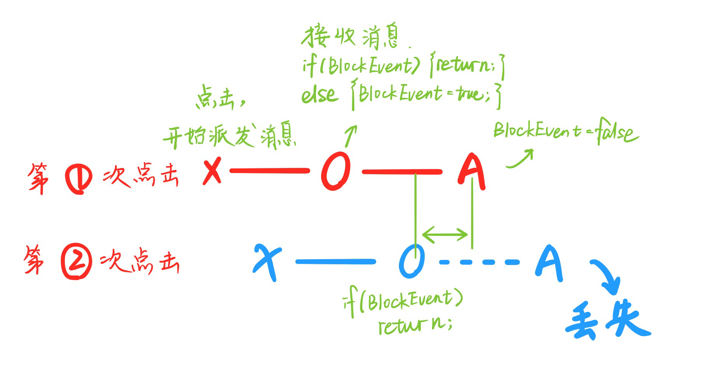

### 一、点击不规则按钮

```typescript
export class HitTest {
    /**
     * 点是否在图形内
     * @param pos 世界坐标
     * @param rect 碰撞节点
     */
    public static posInRect(pos: cc.Vec2, rect: cc.Node): boolean {
        let p = rect.parent.convertToWorldSpaceAR(rect.position);
        let lb = cc.v2(p.x - rect.width / 2, p.y - rect.height / 2);
        let rt = cc.v2(p.x + rect.width / 2, p.y + rect.height / 2);
        let b = pos.x >= lb.x && pos.y >= lb.y && pos.x <= rt.x && pos.y <= rt.y;
        return b;
    }

    /**
     * 图形点击检测, 锚点必须为左上角，或者中心。
     * 所检测的图片不可打包图集
     * @param posw 点击的世界坐标
     * @param sprite 点击的图片
     * @param accurate 是否开始像素精确判定
     */
    public static imgHitTest(posw: cc.Vec2, sprite: cc.Sprite, accurate: boolean = false): boolean {
        if (accurate) {
            let spf = sprite.spriteFrame;
            let pos = sprite.node.convertToNodeSpaceAR(posw);
            if (sprite.node.anchorX == 0 && sprite.node.anchorY == 1) {
                pos.y = -pos.y;
            } else if (sprite.node.anchorX == 0.5 && sprite.node.anchorY == 0.5) {
                let w = sprite.node.width;
                let h = sprite.node.height;
                pos.x = w / 2 + pos.x;
                if (pos.y > 0) {
                    pos.y = h / 2 - pos.y;
                } else {
                    pos.y = h / 2 + Math.abs(pos.y);
                }
            }
            let tex = spf.getTexture();
            let cvs = document.createElement('canvas');
            var ctx = cvs.getContext('2d');
            cvs.width = tex.width;
            cvs.height = tex.height;
            ctx.drawImage(tex.getHtmlElementObj(), 0, 0, tex.width, tex.height, 0, 0, tex.width / 1, tex.height / 1);
            var ctx = cvs.getContext('2d');
            let data = ctx.getImageData(pos.x, pos.y, 1, 1).data;
            console.log(data);

            return data[3] != 0;
        } else {
            this.posInRect(posw, sprite.node);
        }
    }

    /**
     * 点是否在多边形内
     */
    public static polygonInside(point: cc.Vec2, polygon: cc.Vec2[]): boolean {
        let b = false;
        let cn = 0;
        for (let i = 0, l = polygon.length - 1; i < l; i++) {
            let p1 = polygon[i];
            let p2 = polygon[i + 1];
            if ((p1.y < point.y && p2.y > point.y) || (p1.y > point.y && p2.y < point.y)) {
                let vt = (point.y - p1.y) / (p2.y - p1.y);
                if (point.x < p1.x + vt * (p2.x - p1.x)) {
                    ++cn;
                }
            }
        }
        // 判断交点个数是奇数还是偶数，奇数在图内，偶数在图外，如果有特殊图形，则需要特殊判断
        b = cn % 2 == 1;
        return b;
    }
}

```


### 二、资源压缩

* 合并图集。但注意适用于图片大小差不多的情况。若图片素材大小相差过大，会导致图集留白过多，反而导致资源过大。
* `nginx`开启`gzip`压缩
* 切记少用大背景图片，大色块最好用自带素材改色
* CDN加速


### 三、新手引导

[新手引导样例项目](https://github.com/WOC-BUG/Scene-Guide-Demo)


### 四、抽卡游戏，卡牌路径写法

```typescript
export default class TweenUtil {

    /**
     * 水平翻转（卡片翻转）
     * @param node 节点
     * @param duration 总时长
     * @param onMiddle 中间状态回调
     * @param onComplete 完成回调
     */
    public static flip(node: cc.Node, duration: number, onMiddle?: Function, onComplete?: Function): Promise<void> {
        return new Promise<void>(res => {
            const tween = cc.tween,
                time = duration / 2,
                scaleX = node.scale,
                skewY = scaleX > 0 ? 20 : -20;
            tween(node)
                .parallel(
                    tween().to(time, { scaleX: 0 }, { easing: 'quadIn' }),
                    tween().to(time, { skewY: -skewY }, { easing: 'quadOut' }),
                )
                .call(() => {
                    onMiddle && onMiddle();
                })
                .parallel(
                    tween().to(time, { scaleX: -scaleX }, { easing: 'quadOut' }),
                    tween().to(time, { skewY: 0 }, { easing: 'quadIn' }),
                )
                .call(() => {
                    onComplete && onComplete();
                    res();
                })
                .start();
        });
    }

    /**
     * 二阶贝塞尔运动
     * @param node 节点
     * @param duration 移动时间
     * @param posStart 移动起点
     * @param posP 二阶贝塞尔曲线点P
     * @param posEnd 移动终点
     * @param easing 缓动效果
     * @param onComplete 完成回调
     * @returns 
     */
    public static bezier2Move(node: cc.Node, duration: number, posStart: cc.Vec3, posP: cc.Vec3, posEnd: cc.Vec3, easing: string = "", onComplete?: Function): Promise<void> {
        return new Promise<void>(res => {
            node.position = cc.instantiate(posStart);
            cc.tween(node)
                .to(duration, { position: posEnd }, {
                    easing: easing,
                    progress: (start, end, cur, add) => {
                        let pos = cc.v3();
                        pos.x = Math.pow((1 - add), 2) * start.x + 2 * add * (1 - add) * posP.x + Math.pow(add, 2) * end.x;
                        pos.y = Math.pow((1 - add), 2) * start.y + 2 * add * (1 - add) * posP.y + Math.pow(add, 2) * end.y;
                        return pos;
                    }
                })
                .call(() => {
                    onComplete && onComplete();
                    res();
                })
                .start();
        })
    }

    /**
     * 三阶贝塞尔运动
     * @param node 节点
     * @param duration 移动时间
     * @param posStart 起点
     * @param posP1 三阶贝塞尔曲线点P1
     * @param posP2 三阶贝塞尔曲线点P2
     * @param posEnd 终点
     * @param easing 缓动效果
     * @param onComplete 完成回调
     * @returns 
     */
    public static bezier3Move(node: cc.Node, duration: number, posStart: cc.Vec3, posP1: cc.Vec3, posP2: cc.Vec3, posEnd: cc.Vec3, easing: string = "", onComplete?: Function): Promise<void> {
        return new Promise<void>(res => {
            node.position = cc.instantiate(posStart);
            cc.tween(node)
                .to(duration, { position: posEnd }, {
                    easing: easing,
                    progress: (start, end, cur, add) => {
                        let pos = cc.v3();
                        pos.x = start.x * Math.pow(1 - add, 3) + 3 * posP1.x * add * Math.pow(1 - add, 2) + 3 * posP2.x * Math.pow(add, 2) * (1 - add) + end.x * Math.pow(add, 3)
                        pos.y = start.y * Math.pow(1 - add, 3) + 3 * posP1.y * add * Math.pow(1 - add, 2) + 3 * posP2.y * Math.pow(add, 2) * (1 - add) + end.y * Math.pow(add, 3)
                        return pos;
                    }
                })
                .call(() => {
                    onComplete && onComplete();
                    res();
                })
                .start();
        })
    }
}

```


### 五、游戏中常用设计模式

* 单例模式
* 观察者模式


### 六、消息序列机制

按照执行顺序从早到晚排序：

普通代码 -> `Promise()` -> `setTimeout`


### 七、坑

* Cocos Creator 2.4.3 在Button组件被另一个Button覆盖时，只能点击到上层按钮。若点击覆盖部分时，想要两个按钮同时响应，可自己注册监听事件。
* 注意layout布局控件的使用：若子控件有添加和删除操作，记得排布后把父控件的layout属性删掉。否则删哪个都会自动对齐。
* 注意Widget组件的使用，对于需要移动的物体，记得用过后要删除该属性。


### 八、遇到的问题及解决方法

#### 1. 问题描述A

点击到一个按钮派发点击事件，会触发动效和音效。需要在音效结束前禁止其他操作，于是在接受到派发事件后需要启用blockevent(禁止输入面板)。但是，如果点击下一个按钮的速度够快，还是会打断第一次点击的音效。
      

#### 原因

派发事件是需要时间的，第二次点击在第一次派发事件被处理之前，就导致了第一次点击音效被打断
       

#### 解决方案

在处理派发事件之前，判断一下是否启用了blockevent，若有就return，不处理动效。
如图：




#### 2. 问题描述B

但是！上面又导致了新的问题。在网速较差的IOS平台，同步就会出问题。如图：


即，电脑端的两次派发都是独立执行的，没有问题。但在IOS同步的时候，第一次点击时网差卡了一下，开始派发事件的时候晚了一点。第二次同步的时候网又好了，准时开始派发事件。这样会导致IOS端，第二次事件接收时由于第一次事件还没执行完而被丢弃，导致操作无效。

#### 解决办法

删除问题A的解决办法，因为只有我本地出了那个问题（可能是电脑太差了），其他打包出来的平台经测试都没有这个问题。


#### 3. 问题描述C

但是，同样的写法，为什么鼠标的移动事件不会出问题呢？

#### 原因

移动事件的事件派发是一连串的消息，它其实也丢失了第一个事件，但是它持续移动事件多，所以丢一两个不明显。

如图：

